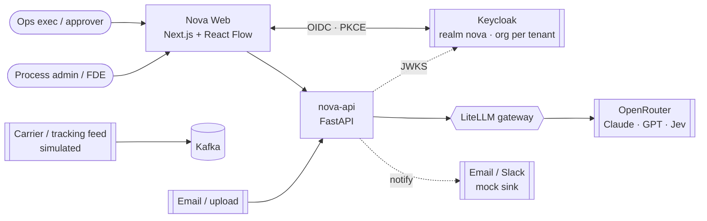
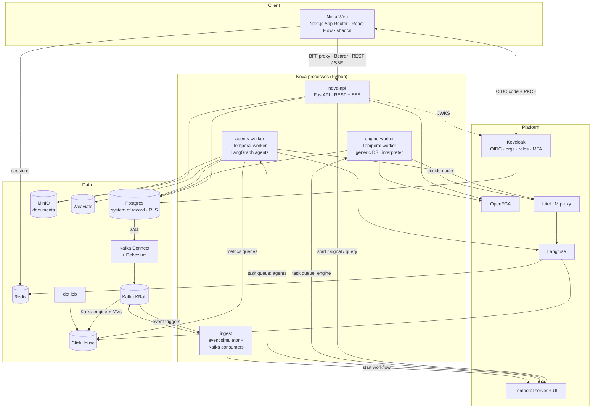
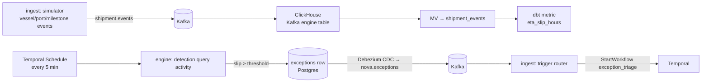
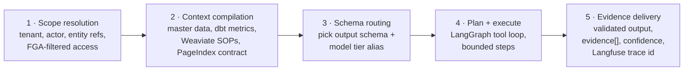

# 02 — High-Level Design

## 1. Architectural style

**Modular monorepo, a few deployable processes, event-driven where it pays.** It is not microservices per pillar. With a team of one to three, the domain boundaries matter more than the deploy boundaries. Each pillar is a Python package with its own public interface, and processes are grouped by *runtime profile* (request/response vs long-running worker vs stream consumer), not by pillar. See [ADR-001](06-adrs.md#adr-001-modular-monorepo-grouped-by-runtime-profile).

## 2. System context



## 3. Container view



### Responsibilities

| Container | Owns | Never does |
|---|---|---|
| **nova-web** | Next.js: routing, layouts, server-rendered read views, client islands (studio, inbox, micro-apps), OIDC BFF (Keycloak login, Redis session), `/api/v1` proxy with bearer | Business logic, DB access, authz decisions |
| **Keycloak** | Identity, tenant Organizations, roles, MFA, sessions, SSO / IdP federation | Authorization decisions on objects |
| **nova-api** | JWT validation (JWKS), OpenFGA checks, CRUD for definitions/apps/docs, DSL validation, start/signal runs, SSE run updates, inbox queries | Long-running work, LLM calls (except "test this node") |
| **engine-worker** | The one generic `NovaWorkflow`: walks the DSL graph, evaluates CEL, runs `decide` via Jev, creates human tasks, waits on signals, timers/SLA/escalation | Domain logic of any specific workflow |
| **agents-worker** | LangGraph agents as Temporal activities: extraction, validation, matching, analysis, recommendation | Workflow control flow (it returns results; the engine decides) |
| **ingest** | Shipment event simulator, Kafka → workflow-trigger router, outbox relay checks | Business decisions |
| **Temporal** | Durable state of every run, retries, timers, versioning | — |
| **OpenFGA** | "Can user U act on task T / see run R / publish workflow W" | — |
| **LiteLLM** | Model aliases, fallbacks, budgets, per-tenant virtual keys, rate limits | — |
| **Postgres** | Tenants, users, definitions, runs projection, tasks, docs, extractions, master data, audit, outbox | Analytics scans |
| **ClickHouse** | Shipment events, step/LLM-cost facts, dbt metrics | Transactions |

## 4. Key flows

### 4.1 Document workflow (BoL / Invoice)

```mermaid
sequenceDiagram
  autonumber
  actor U as Ops exec
  participant W as Web
  participant A as nova-api
  participant T as Temporal
  participant E as engine-worker
  participant G as agents-worker
  participant L as LiteLLM→OpenRouter
  participant F as OpenFGA

  U->>W: upload BoL.pdf
  W->>A: POST /documents (multipart)
  A->>A: store in MinIO, sha256 dedupe, insert documents row
  A->>T: StartWorkflow(NovaWorkflow, def=bol_intake@v3, input)
  T->>E: run NovaWorkflow
  E->>G: activity agent:doc_extractor
  G->>L: nova-extract-text (pdf text layer; vision only for scans) → fields, bboxes from word coords
  G-->>E: Extraction{fields, confidence, evidence}
  E->>G: activity agent:bol_validator
  G-->>E: Validation{issues[], evidence}
  E->>L: decide (Jev): "Is any issue material?"
  E->>F: resolve assignees for role ops_exec
  E->>A: activity create_human_task (Postgres)
  A-->>W: SSE task.created
  U->>W: review in DocumentViewer, fix, approve
  W->>A: POST /tasks/{id}/complete
  A->>F: check can_complete(user, task)
  A->>T: Signal(task_completed, payload)
  T->>E: resume → action:push_to_tms → end
```

### 4.2 Event workflow (exception monitoring)



Why the detour through Postgres → CDC instead of starting the workflow directly from the detector? Exceptions are business records: they need a stable ID, dedupe (one open exception per shipment + type), and audit. CDC then proves the generic "any table change can trigger a workflow" capability. The same router handles uploads arriving via email later.

### 4.3 The 5-stage agent pipeline



Each stage is a LangGraph node in a shared `governed_agent` template. Individual agents only plug in their tools, context sources, and output schema. That template is what "governed business context, not ad-hoc prompting" means in code.

## 5. Data architecture

| Store | Data | Isolation |
|---|---|---|
| Postgres `nova` | tenants, users, roles, workflow_definitions, workflow_runs (projection), run_steps, human_tasks, documents, extractions, master data (POs, bookings, contracts, shipments), exceptions, micro_apps, audit_log, outbox | `tenant_id` on every row + RLS policy on `current_setting('app.tenant_id')` |
| MinIO | original documents, rendered page images | bucket per env, prefix `tenant/{id}/` |
| ClickHouse `nova` | shipment_events, step_facts, llm_cost_facts, dbt models | `tenant_id` first in ORDER BY + row policies per tenant role |
| Weaviate | SOP chunks, carrier playbooks, contract clauses | native multi-tenancy (one Weaviate tenant per Nova tenant) |
| Kafka | `shipment.events`, `nova.outbox`, `cdc.nova.*` | `tenant_id` in key (partitioning + consumer filtering) |
| Temporal | run histories | namespace `nova`; `tenant_id` as search attribute |

**Source of truth rule:** Postgres is the truth for business state, and Temporal is the truth for execution state. `workflow_runs`/`run_steps` in Postgres are a *projection* written by engine activities so the UI can query them without Temporal visibility queries.

## 6. Cross-cutting concerns

- **Identity & access (three layers, one job each):**

  | Layer | Owns | Never does |
  |---|---|---|
  | **Keycloak** (OIDC) | Who you are, which tenant (Organization), which roles; MFA, brute-force protection, sessions, SSO/IdP federation | Object-level decisions, approval limits |
  | **OpenFGA** | Every authz decision: role → capability (RBAC matrix) and object relationships (ReBAC) + `within_limit` | Storing who has which role (roles arrive as contextual tuples from the token) |
  | **Postgres RLS**, CH row policies, Weaviate tenants | Tenant isolation as defence in depth | Role logic |

  A role in the JWT is never enough on its own: every protected endpoint asks OpenFGA. Design: [LLD §7](03-lld.md#7-authorization-openfga), [§7a](03-lld.md#7a-authentication-keycloak), [ADR-018–020](06-adrs.md#adr-018-keycloak-for-authentication-one-realm-one-organization-per-tenant).
- **Observability:** OTel SDK in all Python processes → OTel Collector → (prototype) Jaeger-compatible endpoint in Langfuse / console. Langfuse for LLM. Temporal UI for execution. Until M4, dev exports straight to Jaeger all-in-one on `:16686` (FastAPI, asyncpg and Temporal spans in one trace; [ADR-021](06-adrs.md#adr-021-jaeger-as-the-dev-trace-backend-until-the-m4-collector)).
- **Cost control:** LiteLLM virtual key per tenant with `max_budget`; alias tiers `nova-extract-text`, `nova-extract-vision`, `nova-reason`, `nova-decide`, `nova-embed`; `LLM_MODE=local|cheap|demo` selects the LiteLLM config ([brainstorm §6.3](00-brainstorm.md#63-cost-three-llm-modes-mapped-to-the-models-you-already-have)); Redis response cache on.
- **Idempotency:** every side-effecting activity takes an idempotency key `run_id:node_id:attempt-agnostic`. Outbox for external notifications.
- **Versioning:** definitions are immutable once published. Runs store `definition_version`, and the interpreter uses Temporal `workflow.patched()` only for *engine* code changes, never for client logic.

## 7. Deployment (prototype)

Docker Compose, three profiles plus local LLMs. Target machine: 32 GB RAM, 4C/8T, no usable GPU. WSL2 `.wslconfig`: `memory=24GB`, `processors=8`, `swap=8GB`.

| Profile | Services | ~RAM |
|---|---|---|
| `core` | postgres, redis, minio, temporal, temporal-ui, **keycloak**, openfga, litellm, **ollama** (nomic-embed-text), nova-api, engine-worker, agents-worker, web | ~5.3 GB |
| `data` | kafka (KRaft), kafka-connect+debezium, clickhouse, ingest, dbt (one-shot) | ~3.5 GB |
| `ai` | langfuse-web, langfuse-worker, weaviate, otel-collector | ~2.8 GB |
| **full** = all three | | **~11.6 GB** |
| local LLMs (`LLM_MODE=local\|cheap`) | Ollama keeps at most 2 models loaded, e.g. qwen2.5:7b + gemma3:4b | +6–9 GB |
| **full + local LLMs** | | **~18–21 GB** → fits in the 24 GB WSL cap |

The table is the M7 target. `core` grows one milestone at a time; [07 M0](07-build-plan.md#m0--skeleton) lists the current slice. Since M1, Temporal runs as the single-container dev server (SQLite volume, UI built in on :8233, namespace `default`) instead of server + temporal-ui on Postgres; the `nova` namespace and `tenant_id` search attribute arrive with the Postgres-backed server if load or HA ever need it.

`make up` = core (workflows 1 & 2 run; agent tracing logs locally). `make up-full` = everything (adds workflow 3, Langfuse, and SOP retrieval). `make up-local` = everything + `LLM_MODE=local`: $0 and offline, but CPU-only, so a BoL run takes ~2–4 min (see [brainstorm §6.3](00-brainstorm.md#63-cost-three-llm-modes-mapped-to-the-models-you-already-have)).

## 8. Failure modes & how they're handled

| Failure | Behaviour |
|---|---|
| OpenRouter / model down | LiteLLM fallback chain; then activity retry with backoff; then the run parks in `needs_attention` with a human task |
| Jev unavailable | `nova-decide` alias falls back to a small fast model with the same structured prompt |
| Low extraction confidence | Field-level threshold in YAML routes to human review. Never auto-approves below threshold |
| Worker crash | Temporal replays; activities are idempotent |
| Kafka/ClickHouse down | Document workflows unaffected (they don't depend on the `data` profile); detection schedule fails and retries |
| Keycloak down | Existing sessions keep working until the access token can't be refreshed, then the user re-logs in; new logins fail; the API keeps validating with cached JWKS |
| Role revoked in Keycloak | Effective at the next token refresh (≤ 5 min); FGA never stores roles, so there's nothing to clean up |
| Duplicate upload | sha256 dedupe per tenant returns the existing run |
| LLM returns invalid JSON | Structured output via schema; one repair retry; then a human task |
