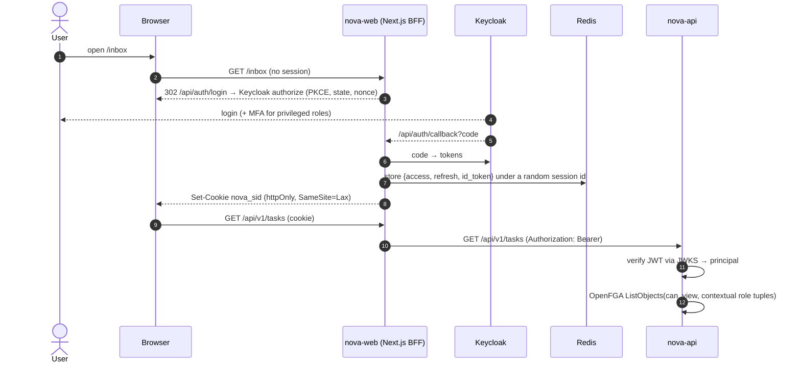

# 03 — Low-Level Design

## 1. Repository layout

Monorepo. Python managed as a **uv workspace**, front end with **pnpm**.

```
nova/
├─ apps/
│  └─ web/                         # Next.js (App Router) + React + TS, output: standalone
│     └─ src/
│        ├─ app/                   # App Router: routes only, thin
│        │  ├─ (auth)/login/
│        │  ├─ (app)/layout.tsx    # shell, providers, session guard
│        │  ├─ (app)/studio/[key]/ # page.tsx (server) → <Studio/> client island
│        │  ├─ (app)/runs/[id]/
│        │  ├─ (app)/inbox/[[...task]]/
│        │  ├─ (app)/documents/  (app)/exceptions/  (app)/admin/
│        │  └─ api/
│        │     ├─ auth/{login,callback,logout}/  # OIDC BFF with Keycloak (openid-client, PKCE); Redis session
│        │     └─ v1/[...path]/    # proxy to nova-api: attach bearer, refresh, stream (SSE)
│        ├─ proxy.ts               # Next.js 16 (was middleware.ts): no session → /api/auth/login
│        ├─ features/
│        │  ├─ studio/             # React Flow editor, YAML pane, node config panels
│        │  ├─ runs/               # run list, live run graph, step inspector
│        │  ├─ inbox/              # human tasks, micro-app host
│        │  ├─ documents/
│        │  ├─ exceptions/         # analytics dashboard (ClickHouse)
│        │  └─ admin/              # tenants, roles, budgets
│        ├─ microapps/             # component registry + JSON renderer
│        ├─ dsl/                   # TS types generated from DSL JSON Schema
│        └─ lib/                   # api client (generated from OpenAPI; server + browser variants), sse, auth
├─ services/
│  ├─ api/          nova_api/      # FastAPI app: routers/, deps.py, sse.py
│  ├─ engine/       nova_engine/   # Temporal worker: interpreter.py, activities/, cel.py, decide.py
│  ├─ agents/       nova_agents/   # Temporal worker: pipeline/ (5 stages), agents/, tools/, extractors/
│  └─ ingest/       nova_ingest/   # simulator.py, trigger_router.py
├─ packages/
│  ├─ nova_core/                   # settings, db (SQLAlchemy 2 async), tenancy ctx, models, authz client, llm client, telemetry
│  └─ nova_dsl/                    # DSL Pydantic models → JSON Schema export, graph validator, YAML loader
├─ definitions/
│  ├─ workflows/{tenant}/*.yaml    # bol_intake, invoice_match, exception_triage per tenant
│  ├─ doc_types/*.yaml             # schema@version + check codes + default workflow (09 §3)
│  ├─ apps/*.json                  # micro-app definitions
│  └─ schemas/*.json               # extraction schemas: bol_v1, invoice_v1
├─ data/
│  ├─ generators/                  # synthetic BoL/invoice PDFs (reportlab), POs, contracts, events
│  └─ sops/                        # markdown SOPs + carrier playbooks → Weaviate
├─ infra/
│  ├─ docker-compose.yml           # profiles: core, data, ai
│  ├─ postgres/init/*.sql          # dbs for nova, temporal, openfga, litellm, langfuse; RLS
│  ├─ clickhouse/init/*.sql
│  ├─ kafka-connect/debezium-nova.json
│  ├─ keycloak/realm-nova.json     # realm as code: clients, roles, orgs Acme/Bolt, dev users
│  ├─ openfga/model.fga
│  ├─ litellm/config.yaml
│  ├─ otel/collector.yaml
│  └─ dbt/                         # dbt-clickhouse project + MetricFlow semantic models
├─ docs/
├─ Makefile                        # up, up-full, seed, demo, test
└─ pyproject.toml                  # uv workspace root
```

**Dependency rule:** `services/*` depend on `packages/*`, never on each other. `nova_dsl` has no I/O, so it's pure and testable, and the API (validation), the engine (interpretation), and the web app (via generated JSON Schema → TS types) all share it.

## 2. Workflow DSL

### 2.1 Shape

```yaml
apiVersion: nova/v1
kind: Workflow
metadata:
  key: bol_intake
  tenant: acme
  title: Bill of Lading intake
  version: 3                 # set by publish, not by author
trigger:
  type: document_upload      # manual | document_upload | event | schedule
  doc_type: bill_of_lading
inputs:                      # JSON Schema of run input
  document_id: {type: string}
nodes:
  - id: extract
    type: agent
    agent: doc_extractor
    with: {document_id: "${{ input.document_id }}", schema: bol_v1}
    retry: {max_attempts: 3}
    timeout: 120s
  - id: validate
    type: agent
    agent: bol_validator
    with: {extraction: "${{ nodes.extract.output }}"}
  - id: material
    type: decide
    questions:
      - id: material_issue
        ask: "Would any of these issues block customs filing or cargo release?"
        context: "${{ nodes.validate.output.issues }}"
  - id: route
    type: rule
    cases:
      - when: "nodes.material.output.material_issue || nodes.extract.output.min_confidence < 0.85"
        goto: review
    default: push
  - id: review
    type: human_task
    title: "Review BoL ${{ nodes.extract.output.fields.bol_number }}"
    assignee: {role: ops_exec}
    app: bol_review
    sla: 4h
    escalate: {after: 4h, to: {role: ops_lead}}
    outputs: [approved, rejected]
  - id: push
    type: action
    action: tms.upsert_shipment            # registered action, mocked
    with: {fields: "${{ nodes.review.output.fields ?? nodes.extract.output.fields }}"}
  - id: done
    type: end
edges:                     # explicit; rule/decide/human_task branch via goto/outputs
  - {from: extract, to: validate}
  - {from: validate, to: material}
  - {from: material, to: route}
  - {from: review, to: push, on: approved}
  - {from: review, to: done, on: rejected}
  - {from: push, to: done}
layout:                    # written by the studio, ignored by the engine
  extract: {x: 0, y: 0}
```

### 2.2 Node types

| Type | Executes in | Semantics |
|---|---|---|
| `trigger` | api / ingest | Starts the run; not a graph node at runtime |
| `agent` | agents-worker activity | Runs the named LangGraph agent and returns its validated output |
| `decide` | engine activity → LiteLLM `nova-decide` (Jev) | N yes/no questions → `{question_id: bool}` + rationale |
| `rule` | engine (in-workflow, deterministic) | CEL `cases` evaluated in order → `goto` |
| `human_task` | engine: create task activity, then `workflow.wait_condition` on signal | Branch by `outputs`; SLA timer → escalate |
| `action` | engine activity | Registered side effect (notify, tms.upsert, http) with idempotency key |
| `parallel` | engine | `branches: [[node ids]]`, `join: all\|any` |
| `wait` | engine | Durable timer or wait-for-event (signal) |
| `subflow` | engine | Child workflow by key@version |
| `end` | engine | Terminal; `status: completed\|rejected\|cancelled` |

### 2.3 Expressions

- Templates `${{ … }}` resolve into values; `rule.when` is a raw CEL expression.
- CEL via `cel-python`. Context variables: `input`, `nodes.<id>.output`, `tenant` (config map), `now`.
- Compiled at publish time (FR-1.6); the compiled AST is cached per definition version.
- CEL is deterministic, so it runs *inside* Temporal workflow code safely. LLM calls never do; they're always activities.

### 2.4 Interpreter (`NovaWorkflow`)

```python
@workflow.defn
class NovaWorkflow:
    @workflow.run
    async def run(self, req: RunRequest) -> RunResult:
        d = await workflow.execute_activity(
            load_definition, req.def_ref
        )  # immutable version + TenantConfig snapshot
        ctx = RunContext(input=req.input, tenant=d.tenant_config)
        node = d.entry
        while node.type != "end":
            await self._project(node, "running")
            out = await HANDLERS[node.type](self, node, ctx)  # each handler is small
            ctx.nodes[node.id] = out
            await self._project(node, "completed", out)
            node = d.next(node, out, ctx)  # edges + rule goto + outputs
        return RunResult(status=node.status, ctx=ctx)

    @workflow.signal
    def task_completed(self, s: TaskSignal):
        self.signals[s.task_id] = s

    @workflow.query
    def state(self) -> RunState: ...
```

- **One workflow type for every client process.** This is "the engine is completely generic" in code.
- `parallel` uses `asyncio.gather` over sub-walks.
- History size: runs over 1,000 events `continue_as_new` with the ctx carried over.
- `_project` writes `run_steps` via a local activity, and the API turns that into SSE.

## 3. Agents

### 3.1 Governed agent template (LangGraph)

```python
class AgentSpec(BaseModel):
    key: str
    output_schema: type[BaseModel]
    model_tier: Literal["extract", "reason", "decide"]
    tools: list[Tool]
    context_sources: list[ContextSource]  # master_data, metric, sop_search, contract_index
    max_steps: int = 8


def build_governed_agent(spec: AgentSpec) -> CompiledGraph:
    g = StateGraph(AgentState)
    g.add_node("scope", resolve_scope)  # tenant, actor, entity refs; FGA list_objects filter
    g.add_node("context", compile_context)  # pulls only allowed sources; token-budgeted
    g.add_node("route", route_schema)  # output schema version + LiteLLM alias
    g.add_node("execute", plan_and_execute)  # tool loop ≤ max_steps
    g.add_node("deliver", deliver_evidence)  # validate → repair once → persist evidence, trace id
    g.add_edge(START, "scope")
    g.add_edge("scope", "context")
    g.add_edge("context", "route")
    g.add_edge("route", "execute")
    g.add_edge("execute", "deliver")
    g.add_edge("deliver", END)
    return g.compile()
```

A single Temporal activity `run_agent(agent_key, input, run_meta)` looks up the spec and invokes the graph, with the Langfuse callback attached and its trace id returned.

### 3.2 Agent catalogue

| Agent | Tier | Tools / context | Output |
|---|---|---|---|
| `doc_extractor` | extract | `pdfplumber` text layer + word bboxes → `nova-extract-text`; `nova-extract-vision` only for pages without text; `Extractor` adapter (DPT-2 optional); schema registry | `fields{}`, per-field `confidence`, `evidence[{page,bbox,text}]` |
| `bol_validator` | reason | deterministic checks first (ISO 6346 check digit, UN/LOCODE lookup, dates, weights sum) → LLM for cross-doc semantics vs booking | `issues[{code,field,severity,evidence}]` |
| `invoice_matcher` | reason | PO lines, rate contract (PageIndex / Weaviate clause search), FX table | `matches[]`, `variance_pct`, `cited_clauses[]` |
| `exception_analyst` | reason | `query_metric` tool (dbt semantic layer → ClickHouse SQL, read-only, tenant row policy) | `severity`, `facts[{sql,rows}]` |
| `action_recommender` | reason | Weaviate SOP search, carrier playbook | `recommendations[{action,why,sop_ref}]` |

**Deterministic before probabilistic.** Validators run code checks first and send only the residue to the LLM. That makes them cheaper, testable, and explainable.

### 3.3 LiteLLM config (excerpt)

```yaml
model_list:
  - model_name: nova-extract-text
    litellm_params: {model: openrouter/anthropic/claude-sonnet-5.5, api_key: os.environ/OPENROUTER_API_KEY}
  - model_name: nova-extract-vision
    litellm_params: {model: openrouter/anthropic/claude-sonnet-5.5}
  - model_name: nova-reason
    litellm_params: {model: openrouter/anthropic/claude-sonnet-5.5}
  - model_name: nova-decide
    litellm_params: {model: openrouter/typesafe/jev-1.13}
  - model_name: nova-decide-fallback
    litellm_params: {model: ollama/gemma3:4b, api_base: http://ollama:11434}
  - model_name: nova-embed
    litellm_params: {model: ollama/nomic-embed-text, api_base: http://ollama:11434}
router_settings:
  fallbacks: [{nova-decide: [nova-decide-fallback]}, {nova-extract-text: [nova-reason]}]
litellm_settings:
  cache: true
  cache_params: {type: redis, host: redis, ttl: 604800}   # 7 days: rehearsals are free
  max_budget: 10            # USD, global hard cap for dev
  budget_duration: 30d
  success_callback: [langfuse]
  failure_callback: [langfuse]
general_settings:
  master_key: os.environ/LITELLM_MASTER_KEY
  database_url: os.environ/LITELLM_DB_URL      # virtual keys + budgets per tenant
```

This is the `demo` config. `infra/litellm/config.{local,free,cheap,demo}.yaml` define the same aliases with different models, and `LLM_MODE` picks one (`free`, the current dev default, routes Groq free tier → OpenRouter `:free`; ADR-025) ([brainstorm §6.3](00-brainstorm.md#63-cost-three-llm-modes-mapped-to-the-models-you-already-have)). Model IDs are placeholders: pin them at build time to whatever OpenRouter lists, and the code only ever names the aliases.

### 3.4 `decide` node contract (Jev)

Request: `questions[]` + compact JSON context (≤ 4K tokens). The prompt forces `{"answers": {"<id>": true|false}, "why": {"<id>": "<≤20 words>"}}`. The engine validates the shape, and a failed parse uses the fallback alias, then a human task. Answers and the rationale are stored as step evidence.

## 4. Data model (Postgres)

All tables have `tenant_id uuid not null` + RLS `USING (tenant_id = current_setting('app.tenant_id')::uuid)`. The app connects as the non-owner role `nova_app`, so RLS can't be bypassed by accident.

```sql
tenants(id, slug, name, keycloak_org_id unique)               -- token organization → tenant
tenant_configs(tenant_id, version, config jsonb, published_by, published_at,  -- thresholds, approval matrix, currencies
               primary key(tenant_id, version))
users(id, tenant_id, email, name)
workflow_definitions(id, tenant_id, key, version, status{draft,published,archived},
                     yaml text, compiled jsonb, published_by, published_at,
                     unique(tenant_id,key,version))
workflow_runs(id, tenant_id, definition_id, config_version, subject_type, subject_id,
              temporal_workflow_id,
              status{pending,running,waiting_human,completed,rejected,cancelled,failed,needs_attention},
              input jsonb, started_at, ended_at, cost_usd numeric)
run_steps(id, run_id, tenant_id, node_id, node_type, status, input jsonb, output jsonb,
          evidence jsonb, trace_id, started_at, ended_at)
human_tasks(id, tenant_id, run_id, node_id, title, app_key, assignee_role, assignee_user,
            status{open,claimed,done,escalated}, due_at, decision text, payload jsonb, completed_by)
documents(id, tenant_id, doc_type, storage_key, sha256, pages int, uploaded_by,
          unique(tenant_id, sha256))
extractions(id, tenant_id, document_id, schema_key, fields jsonb, confidence jsonb, evidence jsonb, model)
-- master data (seeded)
carriers, ports, bookings, purchase_orders, po_lines, rate_contracts, contract_clauses,
shipments(id, tenant_id, container_no, carrier_id, pol, pod, etd, eta_planned, eta_current, status)
invoices(id, tenant_id, document_id, carrier_id, invoice_no, currency, total, lines jsonb)
exceptions(id, tenant_id, shipment_id, type, severity, detected_at, status, facts jsonb,
           unique(tenant_id, shipment_id, type) where status='open')
micro_apps(id, tenant_id, key, version, definition jsonb)
audit_log(id, tenant_id, actor_type{user,agent,system}, actor_id, action, subject, evidence jsonb, at)
outbox(id, tenant_id, aggregate, type, payload jsonb, created_at)   -- Debezium outbox router
action_executions(id, tenant_id, idempotency_key unique, run_id, node_id, action,
                  status{pending,succeeded,failed}, request jsonb, response jsonb, created_at, completed_at)
```

`{…}` status sets are enforced with `CHECK` constraints. `tenant_configs`, the run's `config_version`/`subject_*` columns and `action_executions` come from the domain model, and the run/task state machines are in [09 §7](09-standard-domain-model.md#7-standard-run-lifecycle). Doc types are definitions-as-code in `definitions/doc_types/*.yaml` ([09 §3](09-standard-domain-model.md#3-standard-domain-model)).

## 5. ClickHouse

```sql
CREATE TABLE shipment_events_queue (...) ENGINE = Kafka('kafka:9092','shipment.events','ch','JSONEachRow');
CREATE TABLE shipment_events (
  tenant_id UUID, shipment_id UUID, event_type LowCardinality(String),
  location String, event_time DateTime64(3), eta DateTime64(3), payload String
) ENGINE = MergeTree PARTITION BY toYYYYMM(event_time)
  ORDER BY (tenant_id, shipment_id, event_time);
CREATE MATERIALIZED VIEW shipment_events_mv TO shipment_events AS SELECT ... FROM shipment_events_queue;

-- CDC landing (Debezium → Kafka → CH) for step/run facts
CREATE TABLE step_facts (...) ENGINE = ReplacingMergeTree(_version) ORDER BY (tenant_id, run_id, node_id);
CREATE TABLE llm_cost_facts (...) ENGINE = MergeTree ORDER BY (tenant_id, ts);
```

Row policies: `CREATE ROW POLICY tenant_rp ON nova.* USING tenant_id = getSetting('SQL_tenant_id')`. The agents' `query_metric` tool sets `SQL_tenant_id` per query and runs as a read-only user.

**dbt / MetricFlow metrics:** `eta_slip_hours`, `dwell_time_hours`, `invoice_variance_pct`, `touchless_rate` (runs with no human task / total), `cost_per_run`.

## 6. Kafka topics

| Topic | Key | Producer | Consumers |
|---|---|---|---|
| `shipment.events` | `tenant_id:shipment_id` | simulator | ClickHouse |
| `cdc.nova.public.run_steps` | pk | Debezium | ClickHouse `step_facts` |
| `cdc.nova.public.exceptions` | pk | Debezium | trigger router |
| `nova.outbox.<aggregate>` | aggregate id | Debezium outbox SMT | notifier, trigger router |

Partitions: 6 in the prototype. Consumers are idempotent by (topic, partition, offset) → no-op on replay.

## 7. Authorization (OpenFGA)

Identity and roles come from Keycloak ([§7a](#7a-authentication-keycloak)). OpenFGA makes **every** authorization decision: the RBAC capability matrix plus the object relationships.

```
model
  schema 1.1

type user

type tenant
  relations
    # roles: never stored; sent as contextual tuples from the Keycloak token (ADR-019)
    define platform_admin: [user]
    define tenant_admin: [user]
    define process_designer: [user]
    define ops_exec: [user]
    define ops_lead: [user]
    define finance: [user]
    define controller: [user]
    define auditor: [user]
    define viewer: [user]
    define member: tenant_admin or process_designer or ops_exec or ops_lead or finance or controller or auditor or viewer
    # capabilities = the RBAC matrix (01-prd FR-X.5)
    define can_manage_users: tenant_admin
    define can_edit_config: tenant_admin
    define can_manage_budgets: tenant_admin
    define can_design: tenant_admin or process_designer
    define can_operate: ops_exec or ops_lead or finance
    define can_view: member
    define can_view_analytics: tenant_admin or process_designer or ops_lead or finance or controller or auditor or viewer
    define can_read_audit: tenant_admin or auditor

type platform
  relations
    define admin: [user]
    define can_manage_tenants: admin

type workflow
  relations
    define tenant: [tenant]
    define can_view: can_view from tenant
    define can_edit: can_design from tenant
    define can_publish: can_design from tenant
    define can_start: can_operate from tenant

type run
  relations
    define workflow: [workflow]
    define can_view: can_view from workflow
    define can_cancel: can_publish from workflow

type task
  relations
    define run: [run]
    define assignee: [user, tenant#ops_exec, tenant#ops_lead, tenant#finance, tenant#controller]
    define approver: [user with within_limit, tenant#ops_lead with within_limit, tenant#finance with within_limit, tenant#controller with within_limit]
    define can_view: assignee or approver or can_view from run
    define can_complete: assignee or approver

condition within_limit(amount: double, limit: double) {
  amount <= limit
}
```

**RBAC matrix** (what the capability relations above encode):

| Capability | platform_admin | tenant_admin | process_designer | ops_exec | ops_lead | finance | controller | auditor | viewer |
|---|---|---|---|---|---|---|---|---|---|
| Manage tenants | ✅ | | | | | | | | |
| Manage org users/roles (Keycloak org admin) | | ✅ | | | | | | | |
| Edit/publish TenantConfig | | ✅ | | | | | | | |
| Edit & publish workflows, apps | | ✅ | ✅ | | | | | | |
| Upload documents / start runs | | | | ✅ | ✅ | ✅ | | | |
| View runs & documents | | ✅ | ✅ | ✅ | ✅ | ✅ | ✅ | ✅ | ✅ |
| Complete assigned tasks | | | | ✅ | ✅ | ✅ | ✅ | | |
| Approve within limit | | | | | ✅ | ✅ | ✅ | | |
| Analytics | | ✅ | ✅ | | ✅ | ✅ | ✅ | ✅ | ✅ |
| Read audit log | | ✅ | | | | | | ✅ | |
| Budgets / LLM spend | | ✅ | | | | | | | |

`platform_admin` manages tenants but has **no tenant-data capability** (no RLS bypass). Break-glass support access (time-boxed, audited) is a stretch item.

**Where the facts come from (ADR-026, superseding the persisted-tuple part of ADR-019).** OpenFGA stores only the model (`infra/openfga/model.json`, generated from `model.fga`). Every check sends the caller's roles *and* the object's structure as contextual tuples, read from the tenant-scoped row (`nova_api.authz`):

| Contextual tuple | Built from | Example |
|---|---|---|
| Roles (`tenant:<t>#<role>@user:<sub>`) | the token's `nova-api` client roles | `tenant:<acme-uuid>#finance@user:9f1c…` |
| `platform:nova#admin@user:<sub>` | the `platform_admin` role | |
| `workflow:<t>/<key>#tenant@tenant:<t>` | the object id | |
| `run:<id>#workflow@workflow:<t>/<key>` | `workflow_runs` → `workflow_definitions.key` | |
| `task:<id>#run@run:<id>` | `human_tasks.run_id` | |
| `task:<id>#assignee@tenant:<t>#<role>` | `human_tasks.assignee_role` (tasks without an `amount`) | `…#assignee@tenant:<t>#ops_exec` |
| `task:<id>#approver@tenant:<t>#<role> with within_limit{limit}` | tasks whose payload has `amount`: the assigned role and every role with an equal or higher limit in the run's **pinned** `TenantConfig.approval_limits` (null = unlimited) | `…#approver@tenant:<t>#finance` `{limit: 50000}` |

An approval task gets no plain assignee tuple, so no role bypasses its limit. A task assigned to the unlimited controller stays with the controller: dual control. Model deltas from the original: `task.can_claim = can_complete`, and `tenant#tenant_admin` is assignable, because needs_attention tasks default to it. Object ids use the tenant UUID: `tenant:<uuid>`, `workflow:<uuid>/<key>`.

**Check call** (`nova_api.authz.authorize`, used by every route):

```python
tuples, ctx = await _facts(c, obj)  # RLS read; another tenant's id → 404 before OpenFGA is asked
ok = await fga.check(Check(f"user:{c.sub}", relation, obj, role_tuples(c) + tuples, ctx))
# ctx = {"amount": task.payload["amount"]} for approval tasks; deny → 403 (`above_approval_limit`)
```

The inbox lists open rows and batch-checks `can_claim` (50 per OpenFGA call), so each user sees only what they can act on. `/me` returns the caller's tenant capabilities, which the shell uses to hide what it can't do; the API still enforces every route. OpenFGA unreachable → 503 (fail closed). A role revoked in Keycloak stops working within one access-token lifetime (5 min).

## 7a. Authentication (Keycloak)

| Item | Value |
|---|---|
| Version | Keycloak 26.x (pin at M0) |
| Realm | `nova` (one realm) |
| Tenants | One **Keycloak Organization** per tenant; organization claim in the token → `tenants.keycloak_org_id` → `tenant_id` |
| Clients | `nova-web` (confidential, auth code + PKCE, used only by the Next.js server) · `nova-api` (audience, owns the client roles) · `nova-admin` (service account, provisioning/seed only) |
| Roles | `nova-api` client roles: `platform_admin`, `tenant_admin`, `process_designer`, `ops_exec`, `ops_lead`, `finance`, `controller`, `auditor`, `viewer` |
| Tokens | Access 5 min; refresh rotation; SSO idle 30 min / max 10 h |
| Security | Brute-force detection, password policy, **MFA (OTP/WebAuthn) for `platform_admin`, `tenant_admin`, `finance`, `controller`** in staging/prod (off in the dev realm) |
| Config | `infra/keycloak/realm-nova.json`, imported with `--import-realm` locally; keycloak-config-cli or the Terraform provider in shared envs |
| Events | Login + admin events on, 30-day retention |

**FastAPI validation** (`nova_core.auth`): PyJWT + `PyJWKClient` (cached JWKS from `${KEYCLOAK_ISSUER}/protocol/openid-connect/certs`). It requires a valid signature, `iss`, `aud` containing `nova-api`, `exp`, and `azp=nova-web`. Principal = `{sub, tenant_id, tenant_slug, roles}`. A token without an organization is only accepted for `platform_admin`. `tenant_id` sets `app.tenant_id` for RLS. `users` is a thin mirror (sub, tenant, email, name), upserted on first request.

**Login sequence:**



## 8. API (FastAPI, `/api/v1`)

| Method | Path | Notes |
|---|---|---|
| GET | `/me` | principal from the Keycloak token: sub, tenant, roles, capabilities |
| GET/POST | `/workflows` | list / create draft |
| GET/PUT | `/workflows/{key}/draft` | YAML body; returns validation result |
| POST | `/workflows/{key}/validate` | DSL + graph + CEL + reference checks |
| POST | `/workflows/{key}/publish` | → new immutable version |
| GET | `/workflows/{key}/versions/{v}` | |
| POST | `/runs` | `{workflow_key, version?, input}` |
| GET | `/runs`, `/runs/{id}` | projection + Temporal query fallback |
| GET | `/runs/{id}/stream` | **SSE**: step + task events |
| POST | `/runs/{id}/cancel` | |
| POST | `/documents` | multipart; dedupe; may auto-trigger |
| GET | `/documents/{id}`, `/documents/{id}/pages/{n}` | page image for bbox overlay |
| GET | `/tasks?mine=true` | inbox |
| POST | `/tasks/{id}/claim`, `/tasks/{id}/complete` | FGA check → Temporal signal |
| GET/PUT | `/apps/{key}` | micro-app definitions |
| GET | `/analytics/metrics/{name}` | dbt metric via ClickHouse |
| GET | `/catalog/agents`, `/catalog/actions` | for studio palettes |

Every route except `/healthz` and `/readyz` needs a valid Keycloak access token (`aud=nova-api`) plus the capability below, checked in OpenFGA:

| Route family | Capability (FGA relation on object) |
|---|---|
| `GET /workflows*`, `/runs*`, `/documents*` | `can_view` on tenant / workflow / run |
| `PUT /workflows/{key}/draft`, `PUT /apps/*` | `can_edit` on workflow · `can_design` on tenant |
| `POST /workflows/{key}/publish` | `can_publish` on workflow |
| `POST /runs`, `POST /documents` | `can_start` on workflow · `can_operate` on tenant |
| `POST /runs/{id}/cancel` | `can_cancel` on run |
| `GET /tasks`, `POST /tasks/{id}/claim`, `POST /tasks/{id}/complete` | `ListObjects can_view` · `can_complete` with `{amount}` |
| `GET /analytics/*` | `can_view_analytics` on tenant |
| `GET /audit` | `can_read_audit` on tenant |
| `PUT /tenant-config` | `can_edit_config` on tenant |
| `/admin/tenants*` | `can_manage_tenants` on platform |

Errors use one envelope: `{error:{code,message,details[]}, request_id}`. The OpenAPI spec generates the web client.

## 9. Micro-app definition

```json
{
  "key": "invoice_review",
  "layout": {"type": "split", "children": [
    {"type": "DocumentViewer", "bind": {"document_id": "$.input.document_id",
                                        "highlights": "$.nodes.extract.output.evidence"}},
    {"type": "stack", "children": [
      {"type": "ComparisonTable", "bind": {"rows": "$.nodes.match.output.matches",
                                           "clauses": "$.nodes.match.output.cited_clauses"}},
      {"type": "DecisionBar", "options": ["approve", "dispute", "reject"],
       "requireReasonFor": ["dispute", "reject"]}
    ]}
  ]},
  "output_schema": {"type": "object", "required": ["decision"],
                    "properties": {"decision": {"enum": ["approve","dispute","reject"]},
                                   "reason": {"type": "string"}}}
}
```

Bindings are JSONPath over the task's run-context snapshot. The renderer is a ~100-line recursive component over the registry.

## 10. Front end

| Concern | Choice |
|---|---|
| Framework | **Next.js (App Router)** + React 19 + TypeScript, `output: 'standalone'` Docker image ([ADR-017](06-adrs.md#adr-017-nextjs-app-router-for-the-web-app-fastapi-stays-the-only-backend)) |
| Graph editor | `@xyflow/react` (React Flow) + `elkjs` auto-layout |
| UI kit | Tailwind v4 + shadcn/ui + lucide; `cmdk` command palette |
| Data | Server Components fetch read-only views (run list, analytics) from `nova-api`; TanStack Query in client islands; SSE via `EventSource` → query cache updates |
| Routing | App Router (file-based, route groups `(auth)` / `(app)`); `proxy.ts` session guard; nav items hidden by role (cosmetic; the server enforces) |
| API access | `app/api/v1/[...path]/route.ts` proxies to `nova-api` on the same origin (no CORS): loads the session, refreshes the access token when < 60 s remain, adds `Authorization: Bearer`, and streams the upstream body back (SSE included) |
| Auth | **BFF.** `openid-client` auth code + PKCE against Keycloak; tokens kept server-side in Redis; the browser holds only an httpOnly `SameSite=Lax` session-id cookie ([ADR-020](06-adrs.md#adr-020-nextjs-as-a-bff-tokens-stay-server-side)) |
| YAML pane | Monaco + `monaco-yaml` with the DSL JSON Schema (inline validation + autocomplete) |
| PDF + bbox | `react-pdf` + absolutely-positioned overlay |
| Charts | Recharts (exceptions dashboard) |
| Forms | `@rjsf/core` for `FieldForm` driven by extraction schema |

**Server vs client:** pages are Server Components by default. React Flow, Monaco, `react-pdf` and micro-apps are `"use client"` islands loaded with `next/dynamic({ ssr: false })` because they need `window`. Next.js holds **no business logic and no DB access**: every read and write goes through `nova-api`, which stays the single authority for validation, authz and tenancy.

**Graph ↔ YAML sync:** YAML text is canonical. Graph edits become targeted mutations on an eemeli/`yaml` `parseDocument()` AST, keyed by node `id`, so untouched lines and comments survive byte-for-byte. YAML edits are re-parsed with a 300 ms debounce. If the YAML is invalid, the graph keeps its last valid state. Full design and CI round-trip test: [brainstorm §6.2](00-brainstorm.md#62-react-flow--yaml-sync-how-we-avoid-losing-comments-and-order).

## 11. Testing strategy

- `nova_dsl`: property tests for graph validation; golden YAML fixtures.
- Interpreter: Temporal `WorkflowEnvironment` time-skipping tests, with activities mocked. Covers branching, SLA escalation, signals, `continue_as_new`.
- Agents: deterministic checks unit-tested. LLM paths use recorded responses (VCR) + a small Langfuse eval dataset built from the synthetic seed (planted errors = labels).
- E2E: Playwright demo script: upload → inbox → approve → run completes.
