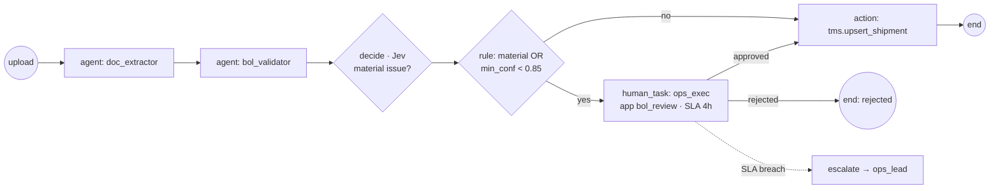
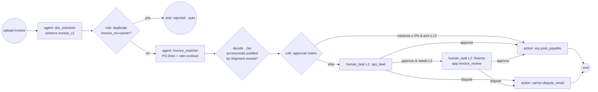
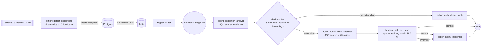

# 04 — Workflow Specs

These are the three demo workflows. Each section gives the business process, the YAML (Acme tenant), the Bolt-tenant divergence, the planted synthetic errors, and the acceptance checks.

---

## W1 · Bill of Lading intake

**Business process.** A forwarder receives a carrier BoL, and its fields have to land in the TMS shipment record. Errors here cause customs holds and demurrage, so the cost of a bad field is high.



YAML: see [LLD §2.1](03-lld.md#21-shape). That example *is* `definitions/workflows/acme/bol_intake.yaml`.

**Extraction schema `bol_v1`:** bol_number, carrier_scac, shipper, consignee, notify_party, vessel, voyage, pol (UN/LOCODE), pod, container_numbers[], seal_numbers[], package_count, gross_weight_kg, description_of_goods, hs_codes[], freight_terms (prepaid/collect), issue_date, booking_ref.

Built in M2 ([ADR-022](06-adrs.md#adr-022-w1-build-decisions-bbox-schema-reference-data-llm-routing-jev-decisions-api)): the schema also has `cargo_lines[{description, hs_code, packages, weight_kg}]`; bookings are seeded master data; the seed set is `definitions/seed/bol_cases.json`, rendered by `scripts/gen_bols.py`. The decide question carries Jev criteria and threshold 0.4; high- and medium-severity issues go to review without asking a model, so the model only judges low-severity residue.

**Validator checks (deterministic first):**

| Code | Check | Severity |
|---|---|---|
| `CNTR_CHECK_DIGIT` | ISO 6346 check digit on each container number | high |
| `LOCODE_UNKNOWN` | pol/pod not in UN/LOCODE seed | high |
| `BOOKING_MISMATCH` | container count / pod / consignee ≠ booking | high |
| `WEIGHT_SUM` | line weights don't sum to gross | medium |
| `DATE_ORDER` | issue_date before booking date | medium |
| `HS_FORMAT` | HS code not 6–10 digits | low |
| `SEMANTIC_GOODS` (LLM) | description inconsistent with HS code | medium |

**Planted errors in the seed (10 BoLs):** 2 bad check digits, 1 unknown LOCODE, 1 consignee mismatch, 1 weight sum off, 1 scan with an ink stain over a container number (DPT-2 can't read it, so the BoL shows 1 container against 2 booked → `BOOKING_MISMATCH` → review; ADR-034), 4 clean.

**Bolt divergence:** Bolt skips human review for `low` severity issues and requires an ops_lead (not ops_exec) for `BOOKING_MISMATCH`.

**Acceptance:** 4 clean BoLs complete touchless. All 6 planted issues produce a human task with the right evidence highlighted.

---

## W2 · Freight invoice ↔ PO match + multi-level approval

**Business process.** A carrier invoices for a shipment. Finance must pay only what was contracted. Variance comes from wrong rates, unapproved accessorials (detention, demurrage), FX, or duplicates. Approval levels depend on amount and variance.



**Approval matrix lives in tenant config, read by CEL:**

```yaml
# definitions/workflows/acme/invoice_match.yaml (excerpt)
  - id: approval
    type: rule
    cases:
      - when: "nodes.match.output.variance_pct <= tenant.invoice.auto_variance_pct && nodes.extract.output.fields.total_usd <= tenant.invoice.auto_limit_usd"
        goto: pay
      - when: "nodes.extract.output.fields.total_usd > tenant.invoice.l2_limit_usd || nodes.match.output.variance_pct > tenant.invoice.l2_variance_pct || !nodes.accessorials.output.justified"
        goto: l1_then_l2
    default: l1_only
```

| Tenant config | Acme | Bolt |
|---|---|---|
| `auto_variance_pct` | 2 | 1 |
| `auto_limit_usd` | 2,000 | 1,000 |
| `l2_limit_usd` | 10,000 | 5,000 |
| `l2_variance_pct` | 5 | 3 |
| levels | L1 ops_lead → L2 finance | L1 ops_lead → L2 finance → L3 controller (`subflow`) |

The OpenFGA `within_limit` condition backs this up at completion time, so an L1 user can't approve above their limit even through the API. Per-role limits live in the same TenantConfig (`approval_limits`) and are copied onto the task's approver tuple when the engine creates it:

| `approval_limits` (USD) | Acme | Bolt |
|---|---|---|
| `ops_lead` | 10,000 | 5,000 |
| `finance` | 50,000 | 25,000 |
| `controller` | unlimited | unlimited |

**Matcher logic:**
1. Deterministic: map invoice lines → PO lines by charge code + container. Compute line variance and FX-normalise to USD.
2. Contract lookup: search rate-contract clauses (Weaviate hybrid search; PageIndex as a stretch) for each charge code. The LLM confirms the applicable rate and **cites the clause ID**.
3. Accessorial justification (`decide`): "Do shipment events show detention > free time?" Context = ClickHouse dwell facts.

**Planted errors (8 invoices):** 1 rate 7% over contract, 1 duplicate invoice number, 1 unjustified detention charge, 1 wrong currency, 1 over L2 limit but clean, 3 clean.

**Acceptance:** each error routes to the expected branch for **both** tenants. Disputes carry the cited clause in the generated email body.

---

## W3 · Shipment exception monitoring

**Business process.** Ops wants to know about a delay before the customer does. Signals include ETA slipping, a missed transhipment, long dwell at port, and rollover. The agent judges severity, gathers facts, and proposes the SOP action.



**Detection rules (dbt metrics, thresholds in tenant config):**

| Type | Rule |
|---|---|
| `ETA_SLIP` | `eta_current - eta_planned > 24h` (Bolt: 12h) |
| `DWELL` | container at transhipment port > 72h |
| `MISSED_TS` | vessel departed TS port, container not loaded |
| `ROLLOVER` | booking moved to later vessel |

**Simulator:** 50 shipments across 6 lanes. It emits gate-in, loaded, departed, arrived, ETA-update, and discharged events at accelerated time (1 sim-day = 1 real minute). Scripted incidents: 3 ETA slips, 1 long dwell, 1 missed transhipment, 1 rollover.

**SOP corpus (`definitions/sops/`, ADR-036):** 15 markdown docs, such as "Rollover: re-book on next sailing, notify consignee within 4h, check free-time impact", including two carrier playbooks (Maersk, MSC). Each `##` section is one chunk, embedded into every Weaviate tenant shard (`make reindex`).

**Acceptance:** all 6 scripted incidents become exceptions within one detection cycle, there are no duplicates for the same shipment + type, the recommendation cites an SOP, and the notification appears in the mock sink.

---

## Cross-workflow guarantees

- Every human decision and every agent output → `audit_log` with evidence + definition version.
- Every run shows its cost (sum of LiteLLM spend tagged with `run_id` metadata).
- Every workflow exists for both tenants, and the only difference between tenants is in YAML or config.
