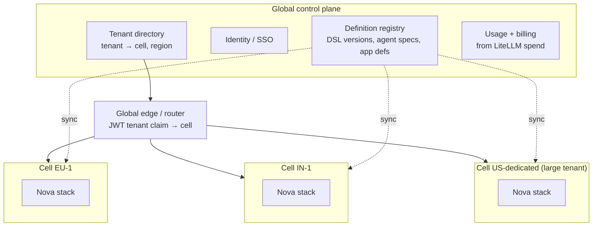

# 05 — Scaling Nova from 1K to 1M Users

"Users" here means enterprise end-users (ops execs, approvers, finance, admins) across all tenants. All figures are planning estimates from the assumptions below. Re-run the math with real telemetry once it exists.

## 1. Workload assumptions

| Driver | Assumption |
|---|---|
| DAU | 30% of registered users |
| API requests | 300 / DAU / day (SSE replaces polling); peak = 4× average |
| Workflow runs | 10 / DAU / day, ~10 steps each |
| Documents | 4 / DAU / day, ~3 pages, ~300 KB PDF |
| LLM calls per document run | extract (vision, ~6K in / 1.5K out) + validate (~3K / 0.5K) + decide via Jev (~1K / 50) |
| Shipments tracked | 20 active per registered user, 8 events / shipment / day |
| Concurrent live sessions | 10% of DAU at peak |

## 2. Capacity math

| Metric | 1K | 10K | 100K | 1M |
|---|---|---|---|---|
| DAU | 300 | 3K | 30K | 300K |
| API rps (avg / peak) | 1 / 4 | 10 / 40 | 104 / 420 | 1,040 / 4,200 |
| Workflow runs / day | 3K | 30K | 300K | 3M |
| Temporal activities / s (peak) | <1 | 1.5 | 140 | 1,400 |
| Documents / day | 1.2K | 12K | 120K | 1.2M |
| LLM calls / s (peak) | 0.2 | 1.7 | 17 | 170 |
| LLM tokens / day | 14M | 144M | 1.4B | 14.4B |
| Shipment events / s (avg / peak) | 2 / 8 | 19 / 75 | 185 / 740 | 1,850 / 7,400 |
| Concurrent SSE connections | 30 | 300 | 3K | 30K |
| OpenFGA checks / s (peak) | 8 | 80 | 850 | 8,500 |
| New doc storage / year | 130 GB | 1.3 TB | 13 TB | 130 TB |
| ClickHouse events / year (compressed ~10×) | 1.8 GB | 18 GB | 180 GB | 1.8 TB |
| Postgres `run_steps` rows / day | 30K | 300K | 3M | 30M |
| **LLM cost / month @ $0.057/doc, no optimisation** | **$2K** | **$20K** | **$205K** | **$2.05M** |
| LLM cost / month @ $0.01/doc target | $360 | $3.6K | $36K | $360K |

**The headline:** the API and database numbers are ordinary even at 1M users. About 4K rps is a well-trodden problem. The things that actually break are, in order:

1. **LLM cost and provider rate limits.** $2M/month and ~170 calls/s against third-party rate limits.
2. **Temporal throughput and history storage.** Shard count is fixed at cluster creation.
3. **Postgres write volume** from run projections and the audit log.
4. **Fan-out of live updates** (30K SSE connections).
5. **Blast radius.** One bad deploy or noisy tenant shouldn't hit every customer.

The design keeps the **DSL, the interpreter, and the agent template unchanged across all four tiers**. Only the topology changes.

## 3. Tier by tier

### Tier 1 — 1K users (pilot: 1–5 tenants)

- **Topology:** the prototype's compose stack on 2 VMs (app + data), or a small managed setup: RDS Postgres, ClickHouse Cloud dev tier, Temporal Cloud, Confluent basic.
- **What's sufficient:** single instance of each service; Kafka 1 broker; ClickHouse 1 node.
- **Must already be true:** tenant isolation (RLS, FGA, Weaviate tenants), LiteLLM per-tenant budgets, backups + PITR on Postgres, OTel + Langfuse.
- **Do now, can't undo later:** pick **Temporal `numHistoryShards` = 512+** (it can't change after creation), or use Temporal Cloud. Put `tenant_id` first in every key and index.
- **Infra cost:** ~$1–2K/month + LLM.

### Tier 2 — 10K users (10–30 tenants)

- **Move to Kubernetes** (EKS/GKE). One Deployment per process, plus **separate worker Deployments per Temporal task queue**: `engine`, `agents-extract`, `agents-reason`, `decide`. Each scales on its own backlog via **KEDA's Temporal scaler**.
- **Postgres:** managed, Multi-AZ, PgBouncer in transaction mode. Monthly partitioning on `run_steps`, `audit_log`, `outbox`.
- **Kafka:** managed (MSK/Confluent), 3 brokers, 12 partitions on `shipment.events`.
- **LLM:** turn on prompt caching for system prompts and schemas. Dedupe extractions by `sha256`. Make `nova-extract-*` **small-model-first, escalate on low confidence**.
- **Web:** Next.js standalone pods (stateless, HPA on CPU) behind a CDN that caches `/_next/static` and images. Server Components only call `nova-api`, so the web tier scales independently of everything else.
- **SLOs introduced:** API p99 < 300 ms; doc-to-task p95 < 60 s; run-start availability 99.9%.

### Tier 3 — 100K users (100+ tenants, first large enterprises)

- **Postgres:** read replicas for inbox and list queries. Hot window of 90 days in Postgres. Older `run_steps`/`audit_log` are already in ClickHouse via CDC, and Postgres partitions get dropped.
- **ClickHouse:** 2 shards × 2 replicas, sharded by `tenant_id`; dbt runs on a schedule; materialised rollups for dashboards.
- **Kafka:** 48 partitions on hot topics, tiered storage, schema registry (Avro/Protobuf) for event contracts.
- **Temporal:** Temporal Cloud, or self-hosted on Cassandra with dedicated frontend/history/matching pools. Namespace per region.
- **OpenFGA:** 3+ replicas, check cache enabled, its own Postgres. Hot checks (e.g. task inbox) use `ListObjects` once per page, not per row.
- **Live updates:** a dedicated push tier (e.g. Centrifugo, or an SSE gateway fed by Redis Streams), ~10K connections/node, decoupled from `nova-api`.
- **LLM cost programme** (this is where the money is):
  - **Layout templates:** the top ~20 carriers produce most BoLs and invoices. After N verified extractions of a layout, cache a template (field → region) and extract with OCR + a small model. Expect 60–80% of documents to skip the big model.
  - **Batch API** (~50% cheaper) for non-urgent work: nightly re-validation, eval runs.
  - **Jev for every boolean decision**; never send yes/no work to a frontier model.
  - **Per-tenant budgets with hard stops**, plus a graceful-degrade path: route to the human queue instead of failing.
- **Governance:** deploy **DataHub/OpenMetadata** for lineage across Postgres → Kafka → ClickHouse → dbt metrics → agents.
- **Isolation:** noisy-neighbour controls: per-tenant Temporal task-queue rate limits, per-tenant LiteLLM RPM/TPM, per-tenant Kafka quotas.

### Tier 4 — 1M users (global, many large enterprises)

**Cell-based architecture.** A *cell* is a complete Nova stack (api, workers, Postgres, Temporal namespace, Kafka, ClickHouse shard set, Weaviate, OpenFGA store) sized for roughly 50–100K users. That means **10–20 cells**.

- **Why cells:** they bound blast radius, cover data residency (EU / India / US), keep each Postgres and Temporal cluster at a size we already know how to run, and give the biggest enterprises dedicated cells. Moving a tenant between cells = Temporal drain + logical replication.
- **Self-hosted inference for the hot path:** with 1.2M docs/day, a fine-tuned open vision-language model on vLLM (GPU pool per region) for extraction becomes cheaper than per-token pricing. LiteLLM keeps the same `nova-extract-*` alias pointing at it, with OpenRouter as the fallback and burst capacity. No agent code changes.
- **Eval-gated model changes:** every model or prompt change runs against the Langfuse eval sets (from verified human corrections) before rollout, canaried per cell.
- **Analytics:** a regional ClickHouse cluster per region. The global view gets only aggregated, non-PII metrics.
- **Ops:** per-cell SLO dashboards, cell-by-cell progressive deploys, chaos tests (kill a worker pool, partition Kafka).
- **Target cost:** under $0.01/doc blended LLM cost, about $360K/month at 1M users. Infra is likely a similar order of magnitude.

## 4. Summary matrix

| Component | 1K | 10K | 100K | 1M |
|---|---|---|---|---|
| Runtime | Compose / 2 VMs | K8s + HPA/KEDA | K8s multi-AZ | Cells × regions |
| Postgres | 1 managed | Multi-AZ + PgBouncer + partitions | + read replicas, 90-day hot | per cell (+ Citus inside large cells) |
| Temporal | Cloud / 512 shards | Cloud | Cloud / Cassandra | namespace per cell |
| Kafka | 1 broker | 3 brokers managed | 48 partitions, schema registry, tiered | per region |
| ClickHouse | 1 node | 1 node + replica | 2×2 sharded | regional clusters |
| Keycloak | 1 node | 2 nodes HA (Infinispan) | 3+ per region | multi-site global IdP in the control plane; orgs = tenants |
| OpenFGA | 1 | 2 | 3+ with cache | per cell |
| Live updates | SSE from api | SSE from api | push gateway | push gateway per cell |
| LLM | OpenRouter via LiteLLM | + caching, small-first | + templates, batch, budgets | + self-hosted VLM, eval-gated |
| Catalog | — | — | DataHub/OpenMetadata | federated per region |

## 5. Scaling triggers (when to move up a tier)

| Signal | Threshold | Action |
|---|---|---|
| Temporal schedule-to-start latency | p95 > 2 s for 15 min | Add worker replicas for that queue (KEDA does it automatically) |
| Postgres CPU | > 65% sustained | Read replicas → partition pruning → cell split |
| Kafka consumer lag (ClickHouse) | > 60 s | Add partitions + CH consumers |
| LLM spend per doc | > 2× target for 7 days | Prioritise layout templates for the top offending carriers |
| Provider 429s | > 1% of LLM calls | Add provider fallbacks, raise limits, move to batch |
| Largest tenant share | > 20% of a cell | Dedicated cell |
